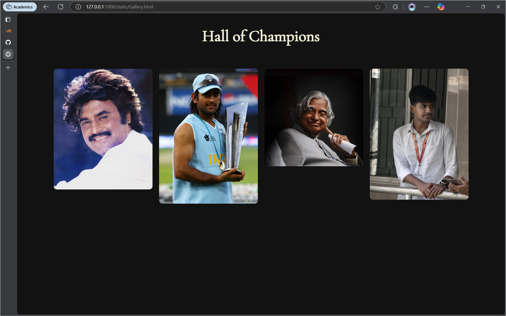
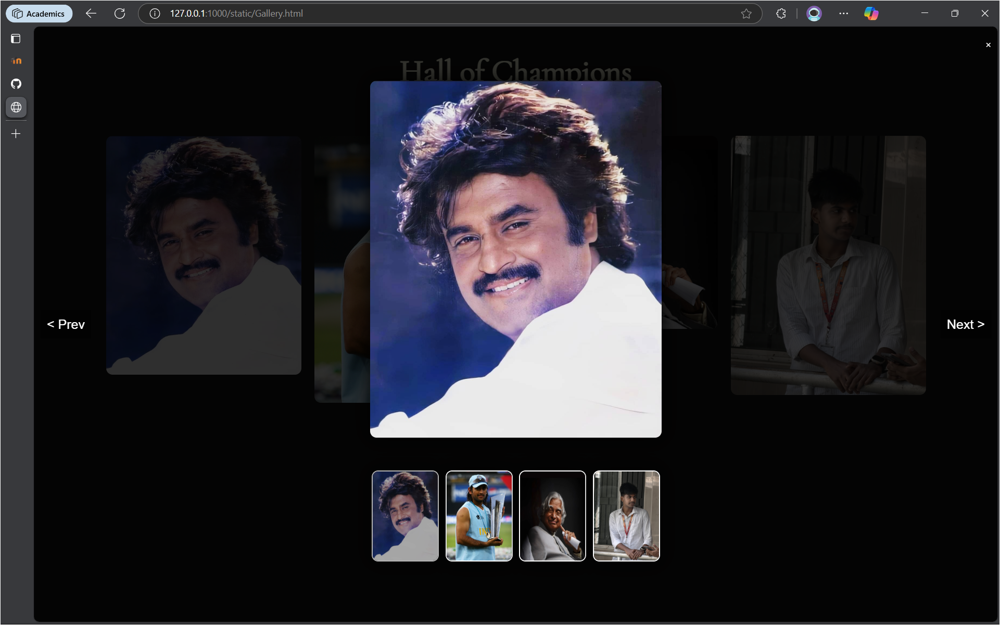
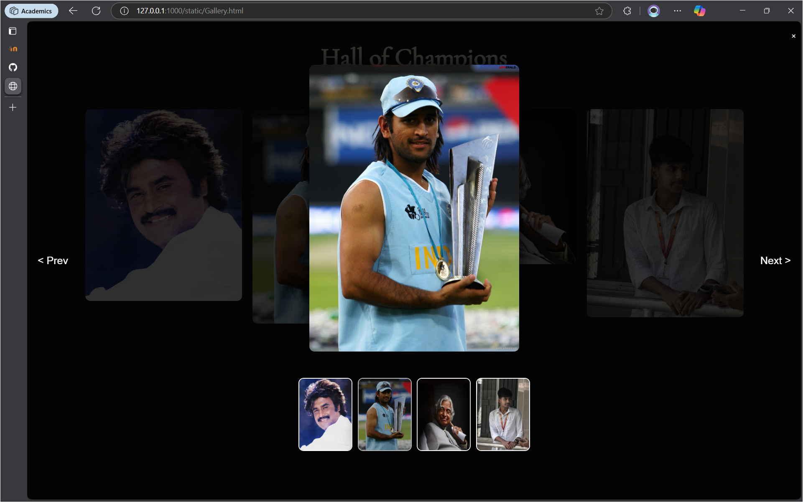
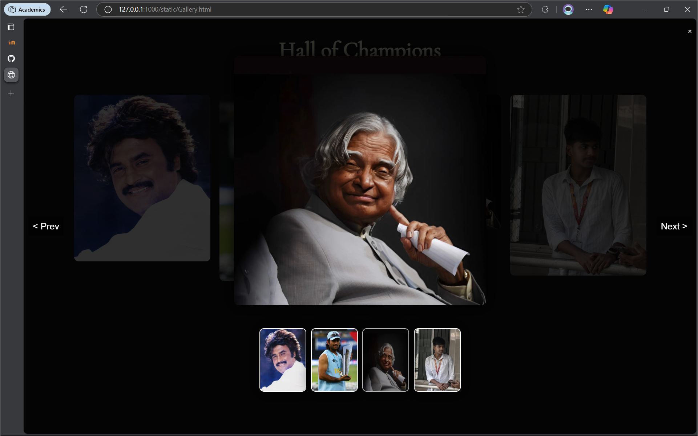
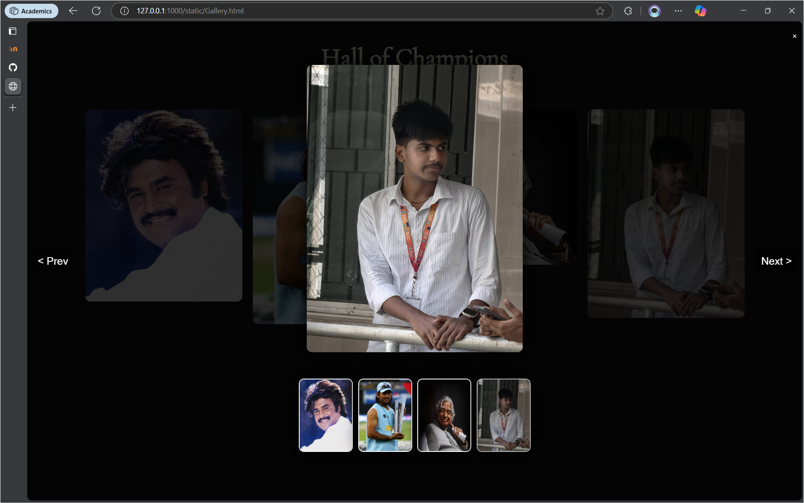

# Ex.08 Design of Interactive Image Gallery
## Developed by : **KABELAN G K**
## Reg No : **212224110027**
### Date : 05 - 05 - 2025
## AIM
  To design a web application for an inteactive image gallery with minimum five images.

## DESIGN STEPS

### Step 1:

Clone the github repository and create Django admin interface

### Step 2:

Change settings.py file to allow request from all hosts.

### Step 3:

Use CSS for positioning and styling.

### Step 4:

Write JavaScript program for implementing interactivit

### Step 5:

Validate the HTML and CSS code

### Step 6:

Publish the website in the given URL.

## PROGRAM
### Gallery.html

```html
<!DOCTYPE html>
<html lang="en">
<head>
    <meta charset="UTF-8">
    <meta name="viewport" content="width=device-width, initial-scale=1.0">
    <title>My Fav</title>
    <link rel="stylesheet" href="Gallery.css">
</head>
<body>
    <h1>Hall of Champions</h1>

    <div class="gallery" onclick="openLightbox(event)">
        
        
        
        
    </div>

    <div id="lightbox">
        <span id="close-btn" onclick="closeLightbox()">&times;</span>

        

        <div id="thumbnail-container">
        </div>
        <button id="prev-btn" onclick="changeImage(-1)">&lt; Prev</button>
        <button id="next-btn" onclick="changeImage(1)">Next &gt;</button>
    </div>
    <script src="Gallery.js"></script>

</body>
</html>
```
Galler.css and Gallery .js are attached to the Repository.

## OUTPUT
    

## RESULT
  The program for designing an interactive image gallery using HTML, CSS and JavaScript is executed successfully.
